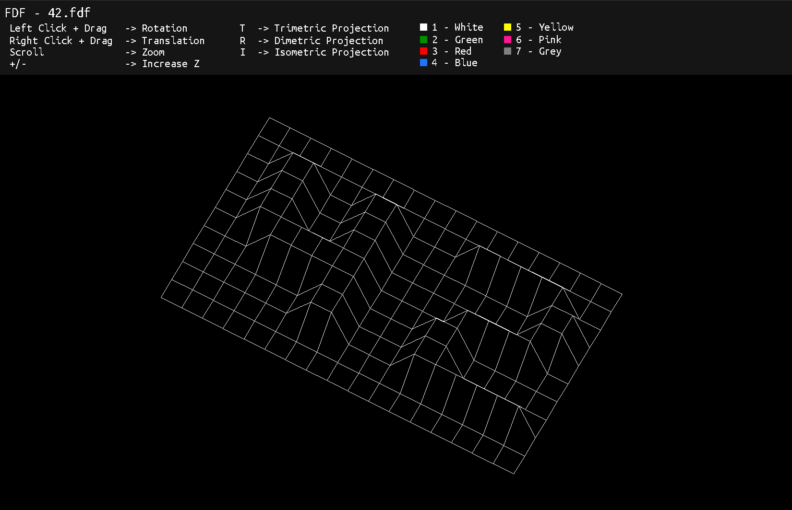

# FdF - SDL



Re-implementation of the FdF project of the cursus 42 with the SDL2 graphic lib (the original project uses the minilibX)

Here is [the original project](https://git.chevro.fr/42-cestoliv/fdf) with the MinilibX.

## Compilation

You need `sdl2` and `sd2_ttf` installed and available on your system. You can verify the installation by checking that `sdl2-config --libs `returns something

```bash
make
```

Will produce an `fdf` executable.

## Usage

```bash
./fdf <map file>
```

You can use the maps generated by our tools [Fdf Maps Generation](https://git.chevro.fr/fdf-maps)
